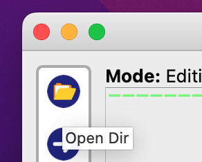
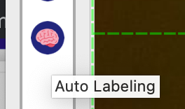
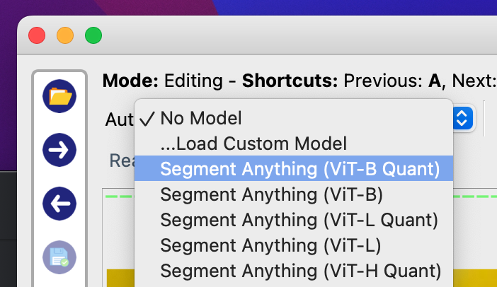

# Train a YOLOv8 Model (but with much less manual work)

## Prerequisites

You need to at least have:

- [Python 3.8+](https://www.python.org/downloads/)
- [Node.js LTS](https://nodejs.org/en) (because I don't want to write the script in Python)

You may either install all the packages within a virtual environment or install only auxiliary packages in the virtual env. I recommend doing a global installation so you can access the YOLO CLI from anywhere.

### Global installation

Install PyTorch: https://pytorch.org/get-started/locally/

Then install YOLOv8:

```bash
pip3 install ultralytics
```

Then, configure additional required packages:

```bash
python3 -m venv venv
source venv/bin/activate
pip3 install -r requirements.txt
npm install
```

### Self-contained

To install everything self-contained, run the following first:

```bash
python3 -m venv venv
source venv/bin/activate
```

Then run through all other steps above in order.

> You must always enter the virtual env before using YOLO CLI.

## Setup working directory for your model

Create a new folder in datasets, for example `costa-cups-test`, then create a folder called `images` within.

## Gather Images

You should now populate the `images` folder with your chosen images that you want to use for training.

### Scrape Images

To make this go faster, you can scrape images directly from a site such as Bing.

```bash
# drop into an interpreter shell
python3
```

Run the following code, adjust as needed:

```python
from bing_image_downloader import downloader

downloader.download(
    "Costa Coffee",
    limit=128,
    output_dir="bing_images",
    adult_filter_off=True,
    force_replace=False,
    timeout=60,
    verbose=True,
)
```

This utility outputs to a sub-folder of the target directory, copy from that directory directly into the `images` folder.

## Label the data

To label the data quickly, install [Anylabeling](https://anylabeling.com/) (select "download binary" to avoid headaches).

Once you have it open, select "open directory" and use the images folder made earlier.



Then select "auto labeling" from the tool sidebar:



At the top, you can now select a model, this will depend on your hardware but you want to use one of the Segment Anything models:



I would recommend just using ViT-B since it has the best speed / accuracy compromise for this work.

<video src="assets/demo.mp4" controls muted autoplay></video>

At this point, you can either choose to make segments or rectangles depending on your use-case.

## Convert into YOLO training format

Now you must convert the JSON data provided by Anylabeling into something YOLO can parse and learn.

```bash
# extract segmentation
node convert.mjs costa-cups-test segment

# extract bounding boxes
node convert.mjs costa-cups-test bbox
```

## Run training on the dataset

Now we can train the model on the dataset, the YOLO CLI will automatically download the required base models for you.

There are a range of base models you may use, I recommend just using the "n" variants to start since they are relatively small, and then adjust for your needs. [Further information is available here](https://docs.ultralytics.com/models/yolov8/).

| Model Type | Pre-trained Weights                                                                      | Task         |
| ---------- | ---------------------------------------------------------------------------------------- | ------------ |
| YOLOv8     | `yolov8n.pt`, `yolov8s.pt`, `yolov8m.pt`, `yolov8l.pt`, `yolov8x.pt`                     | Detection    |
| YOLOv8-seg | `yolov8n-seg.pt`, `yolov8s-seg.pt`, `yolov8m-seg.pt`, `yolov8l-seg.pt`, `yolov8x-seg.pt` | Segmentation |

For example, if you extracted segmentation data earlier, you can now run:

```bash
yolo detect train data=datasets/costa-cups-test/config.yml model=yolov8n-seg.pt epochs=10 imgsz=320
```

In this scenario, we train on our data set `costa-cups-test` using the base model `yolov8n-seg.pt` for `10` epochs and resizing each image to be at most 320px.

> You may find, 10 epochs to not be enough for any viable results or the base model to not be satisfactory, this is largely up to the user to figure out.

## Use it

It will tell you where to copy the file from once it is done training.

```bash
cp /opt/homebrew/runs/segment/train2/weights/best.pt datasets/costa-cups-test/trained.pt
```

Now you can evaluate your model:

```bash
yolo detect predict model=datasets/costa-cups-test/trained.pt source="path/to/image.jpg"
```
